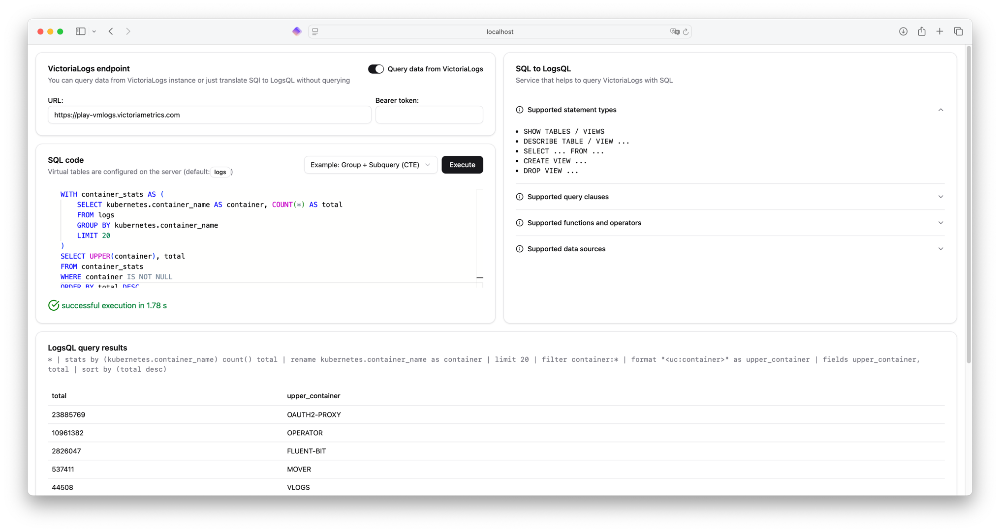

[](https://github.com/VictoriaMetrics/sql-to-logsql/releases)


# sql-to-logsql

Web application that provides a simple proof-of-concept UI for querying [VictoriaLogs](https://docs.victoriametrics.com/victorialogs/) or [VictoriaTraces](https://docs.victoriametrics.com/victoriatraces/) data with SQL.

It lets you write familiar SQL against your log data and instantly translates it to [VictoriaLogs LogsQL](https://docs.victoriametrics.com/victorialogs/logsql/) queries. 
It can optionally execute the resulting LogsQL against a VictoriaLogs instance, manage reusable views that are stored on disk, and ships with a lightweight web UI for interactive use.

[](https://play-sql.victoriametrics.com)

## Highlights

- Go app + library with zero dependencies
- Translate `SELECT`, `DESCRIBE`, `SHOW`, `CREATE`, and `DROP` statements from ANSI-like SQL into [LogsQL](https://docs.victoriametrics.com/victorialogs/logsql/) pipelines and query data from [VictoriaLogs](https://docs.victoriametrics.com/victorialogs/) or [VictoriaTraces](https://docs.victoriametrics.com/victoriatraces/).
- Simple [Web UI](#web-ui) featuring SQL editing, example gallery, and query results rendering.
- Simple [REST API](#rest-api) (`/api/v1/sql-to-logsql`) that you can call from scripts, CI, or other services.
- Persist and manage `.logsql` view definitions on the filesystem (with locking, `OR REPLACE`, and `IF NOT EXISTS` support).

## Quick start

### Try without installation

You can try the live demo on **[play-sql.victoriametrics.com](https://play-sql.victoriametrics.com)**

### Use binaries

Just download the latest release from [Releases](https://github.com/VictoriaMetrics/sql-to-logsql/releases) page and run it.

### Run Docker image

You can run **sql-to-logsql** using Docker.
This is the easiest way to get started without needing to install Go or build from source:

```bash
docker run -d --name sql-to-logsql -p 8080:8080 -v /data/views \
  ghcr.io/victoriametrics/sql-to-logsql:latest
```

Here is the example with specified [config file](#configuration):

```bash
cat > config.json << EOL
{
  "listenAddr": ":8080",
  "endpoint": "https://play-vmlogs.victoriametrics.com",
  "bearerToken": "",
  "tables": {
    "logs": "*",
    "errors": "* | log.level:ERROR",
    "traces": "* | span_id:*"
  },
  "viewsDir": "/home/sql-to-logsql/data/views"
}
EOL

docker run -d --name sql-to-logsql -p 8080:8080 \
  -v /home/sql-to-logsql/data/views \
  -v ./config.json:/home/sql-to-logsql/config.json:ro \
  ghcr.io/victoriametrics/sql-to-logsql:latest \
  --config=config.json
```

### Run locally with Go

1. Install Go 1.25+, Node.js 18+ (Node 24 recommended, matching the Docker builder), and npm.
2. Run the comand (defaults to `:8080`):
   ```bash
   make run
   ```
   `make run` compiles the frontend (`npm install && npm run build`) and then executes `go run ./cmd/sql-to-logsql`.
3. Verify the service:
   ```bash
   curl http://localhost:8080/healthz
   # {"status":"ok"}
   ```
4. Open <http://localhost:8080> to use the web UI.

You can skip the UI rebuild if the embedded bundle already exists:
```bash
go run ./cmd/sql-to-logsql
```

### Use Docker (build from sources)

Build and run the containerised service (no Node.js required on the host):

```bash
docker build -t sql-to-logsql .
docker run -d -p 8080:8080 -v /data/views sql-to-logsql
```

## Configuration

The binary accepts an optional JSON configuration file with the `-config` flag:
```bash
sql-to-logsql -config ./config.json
```

Example (`config.json`):
```json
{
  "listenAddr": ":8080",
  "endpoint": "https://play-vmlogs.victoriametrics.com",
  "bearerToken": "<VM_BEARER_TOKEN>",
  "tables": {
    "logs": "*",
    "errors": "* | level:ERROR",
    "traces": "* | span_id:*"
  },
  "viewsDir": "./data/views"
}
```

| Field         | Type              | Description                                                                                                             | Default           |
|---------------|-------------------|-------------------------------------------------------------------------------------------------------------------------|-------------------|
| `listenAddr`  | string            | Address the HTTP server binds to.                                                                                       | `:8080`           |
| `endpoint`    | string            | VictoriaLogs base URL. Can be left empty (in this case you can specify it in UI or translate without executing queries) | empty             |
| `bearerToken` | string            | Optional bearer token injected into VictoriaLogs requests when `endpoint` is set.                                       | empty             |
| `tables`      | map[string]string | Mapping from SQL table name to LogsQL filter or pipeline fragment. Keys are case-insensitive.                           | `{ "logs": "*" }` |
| `viewsDir`    | string            | Directory that stores `.logsql` files for views. Required for `CREATE VIEW`, `DROP VIEW`, and `SHOW VIEWS`.             | `./data/views`    |

Please note that VictoriaLogs is called via the backend, so if you are using sql-to-logsql in Docker, localhost refers to the localhost of the container, not your computer.

## SQL features and limits

Supported highlights:

- `SELECT` with :
  - aliases, 
  - arithmetic expressions, 
  - string helpers (`SUBSTR`, `CONCAT`, `TRIM`, `REPLACE`, `LOWER`, `UPPER`), 
  - math (`ABS`, `CEIL`, `FLOOR`, `ROUND`, `LEAST`, `GREATEST`), 
  - JSON (`JSON_VALUE`),
  - and date helpers (`CURRENT_DATE`, `CURRENT_TIMESTAMP`).
- `WHERE` with comparison operators, `BETWEEN`, `IN`, `LIKE`, `IS (NOT) NULL`
- `ORDER BY`, `LIMIT`, `OFFSET`, `DISTINCT`
- Common Table Expressions (CTE) using `WITH` keyword and subqueries
- `GROUP BY`, `HAVING`, `COUNT/SUM/AVG/MIN/MAX`
- Window functions (`OVER (PARTITION BY ... ORDER BY ...)`) for `SUM` and `COUNT`
- `JOIN` (inner/left) on equality predicates, including subqueries.
- Set operations: `UNION ALL`
- Meta statements: 
  - `DESCRIBE TABLE`, `DESCRIBE VIEW`, 
  - `SHOW TABLES`, `SHOW VIEWS`, 
  - `CREATE [OR REPLACE] VIEW`, `CREATE VIEW IF NOT EXISTS`, `DROP VIEW [IF EXISTS]`.

Known limitations:

- `CASE/WHEN` is not supported
- Recursive CTEs, `UNION DISTINCT`, and `INTERSECT`/`EXCEPT` are not supported.
- Only a curated subset of SQL scalar and window functions is implemented; unsupported functions raise explicit translation errors
- `RIGHT/OUTER JOIN` is not supported, supported only JOINS with the same field name in both sides 

## Working with views

- Views live as `.logsql` files under `viewsDir` (default `./data/views`). The name `My.View` becomes `my_view.logsql`.
- `CREATE VIEW` writes the translated LogsQL statement to disk (always ending with a newline) and returns the query text.
- `CREATE VIEW IF NOT EXISTS` leaves existing files untouched; `CREATE OR REPLACE VIEW` atomically swaps the existing file.
- Lock files (`*.lock`) guarantee safe concurrent writes and are cleaned up automatically.
- `SELECT` from a view loads the stored LogsQL and combines it with additional filters in the SQL query.
- `SHOW VIEWS` returns one JSON document per line with `view_name` and `query` fields. `DESCRIBE VIEW` resolves to the underlying LogsQL and reuses the VictoriaLogs describe endpoint when executing.

## REST API

All JSON responses include either a translated `logsql` statement, optional `data` payload (raw VictoriaLogs response or newline-delimited JSON), or an `error` message. 
Security headers (`X-Content-Type-Options`, `X-Frame-Options`, `X-XSS-Protection`) are set on every response.

### `POST /api/v1/sql-to-logsql`

Translate (and optionally execute) a SQL statement.

Request body:
```json
{
  "sql": "SELECT * FROM logs LIMIT 10",
  "endpoint": "https://victoria-logs.example.com",
  "bearerToken": "token"
}
```

Successful response:

```json
{
  "logsql": "* | limit 10",
  "data": "{\"table\":\"logs\",\"count\":10}\n"
}
```

Errors emit `HTTP 4xx/5xx` with `{ "error": "..." }`. 
Parser, translator, VictoriaLogs client, and view-store errors map to informative messages (`400`, `409`, `423`, `502`, etc.).

### `GET /api/v1/endpoint`

Returns the compile-time endpoint configured on the server (used by the UI to decide whether the endpoint fields should be read-only):

```json
{ "endpoint": "https://victoria-logs.example.com" }
```

### `GET /healthz`

Simple health endpoint returning `{ "status": "ok" }`.

### Static UI

`GET /` and any unrecognised path serves the embedded web bundle (`cmd/sql-to-logsql/web/dist`). Assets are cached in memory on first access.

## Web UI

Key features:

- **SQL editor** with syntax highlighting, keyword completions, example gallery (`examples.ts`), and keyboard shortcuts (`Shift/Ctrl/Cmd + Enter`).
- **Endpoint panel** to toggle VictoriaLogs execution, edit URL/token, or switch to translation-only mode. If the server was booted with a fixed endpoint, fields are prefilled and locked.
- **Result viewer** rendering newline-delimited JSON into a table when VictoriaLogs is queried, or showing the translated LogsQL when running offline.
- **Docs sidebar** explaining supported SQL syntax.

## Contributing

Contributions are welcome. Please:
- Read and follow the [Code of Conduct](CODE_OF_CONDUCT.md).
- Run `make all` before submitting a PR.
- Ensure new SQL features include translation tests under `lib/logsql` and, when relevant, API tests under `cmd/sql-to-logsql/api`.

## License

Licensed under the [Apache License, Version 2.0](LICENSE).
